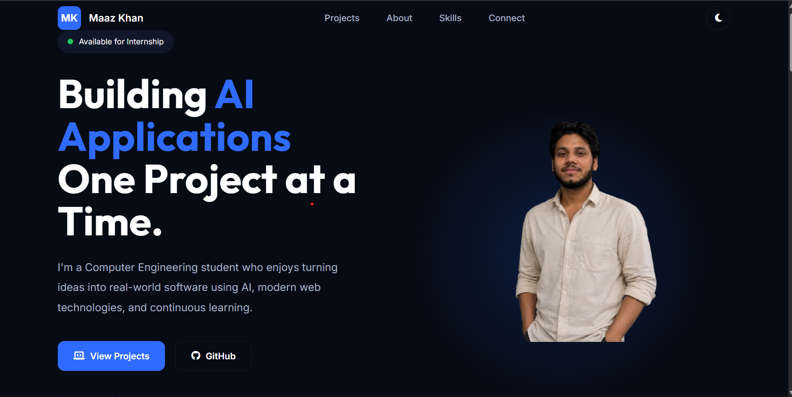

# 🌐 Maaz Khan - Portfolio

A modern, responsive personal portfolio showcasing my projects, technical skills, and journey as a **Computer Engineering student** passionate about **Artificial Intelligence** and **Software Development**.

## 🚀 Live Website

🔗 https://maaz-portfolio-orpin.vercel.app

---

## 📌 About

This portfolio was built to present my projects, technical skills, and experience in a clean and professional way. It includes:

- Responsive modern UI
- Featured Projects
- About Me
- Technical Skills
- Contact Form
- Resume Download
- GitHub & LinkedIn Integration

---

## ✨ Features

- 📱 Fully Responsive Design
- 🎨 Modern Dark UI
- 📂 Project Showcase
- 📄 Resume Download
- 📧 Working Contact Form
- 🔗 GitHub & Live Demo Links
- ⚡ Fast Deployment with Vercel

---

## 🛠️ Tech Stack

### Frontend

- HTML5
- CSS3
- JavaScript

### Tools

- Git
- GitHub
- VS Code
- Vercel

---

## 📂 Featured Projects

### 🤖 AI Research Assistant

A multi-agent AI application that researches topics, summarizes information, performs fact checking, and generates structured reports.

**Tech Stack**

- Python
- CrewAI
- OpenRouter API

GitHub:
https://github.com/maazcrafts/AI-Research-Assistant

---

### 🏦 Bank Account Management System

A responsive banking web application with account management and transaction handling.

**Tech Stack**

- HTML
- CSS
- JavaScript

GitHub:
https://github.com/maazcrafts/bank-account-management-system

Live Demo:
https://maazcrafts.github.io/bank-account-management-system/

---

### 🎵 TuneX Music Player

A responsive music player with playlist management and playback controls.

**Tech Stack**

- HTML
- CSS
- JavaScript

GitHub:
https://github.com/maazcrafts/TuneX

Live Demo:
https://maazcrafts.github.io/TuneX/

---

### ✂️ Rock Paper Scissors

Interactive browser game built using JavaScript.

GitHub:
https://github.com/maazcrafts/r-p-s

Live Demo:
https://maazcrafts.github.io/r-p-s/

---

## 📸 Portfolio Preview



Example:

```
portfolio-preview.png
```

---

## 📥 Installation

Clone the repository

```bash
git clone https://github.com/maazcrafts/maaz-portfolio.git
```

Open the project

```bash
cd maaz-portfolio
```

Run using VS Code Live Server or simply open `index.html` in your browser.

---

## 📬 Contact

**Maaz Khan**

📧 maazsabirkhan@gmail.com

💼 LinkedIn

https://linkedin.com/in/khan-maaz-8a3345377

🐙 GitHub

https://github.com/maazcrafts

🧩 LeetCode

https://leetcode.com/u/maazcrafts

---

## ⭐ If you like this project

If you found this portfolio helpful or inspiring, consider giving the repository a ⭐ on GitHub.

---

© 2026 Maaz Khan. All Rights Reserved.